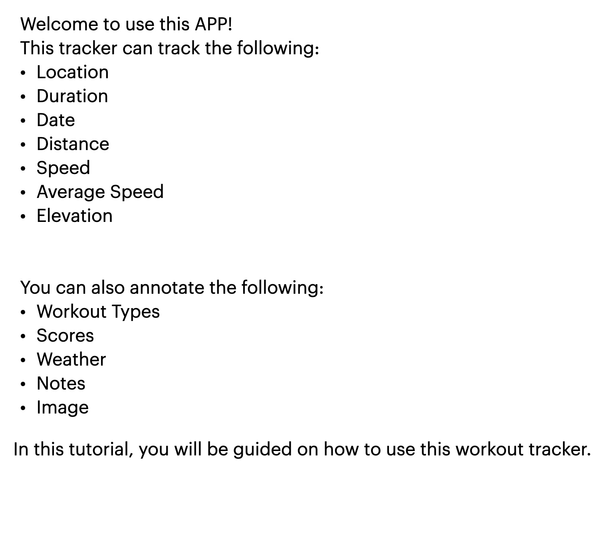
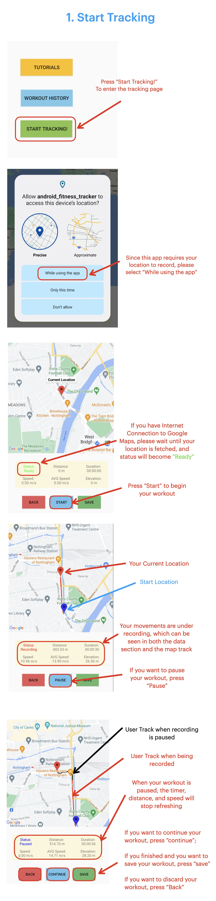
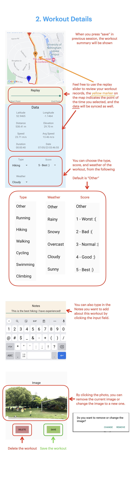
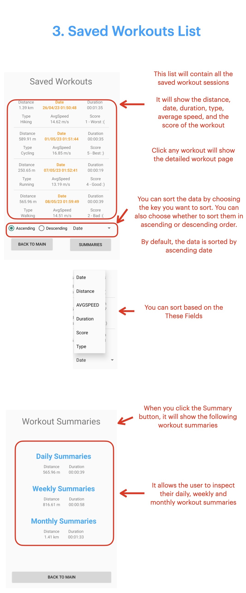

An android fitness tracking application that allows users to track workouts and capture vital metrics. The app renders user trajectories on dynamic map provided by Google Maps API. Users can efficiently retrieve detailed histories at any given time point, and label the data with personalized annotations and options.

## How to use:

1. Get a Google Maps API from Google as shown here: [Maps SDK for Android Quickstart](https://developers.google.com/maps/documentation/android-sdk/start)

2. Create a file named `secrets.properties`. Store your API KEY inside this file as formatted: 
   
   `MAPS_API_KEY="ABCDEFG"`

3. Build the project and run! 

## The location recording page

  

## The summary page

# User Manual

